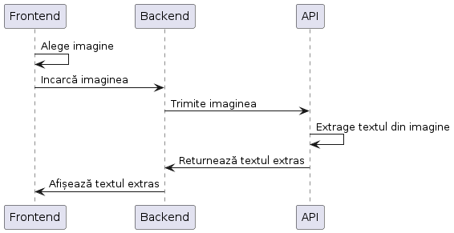
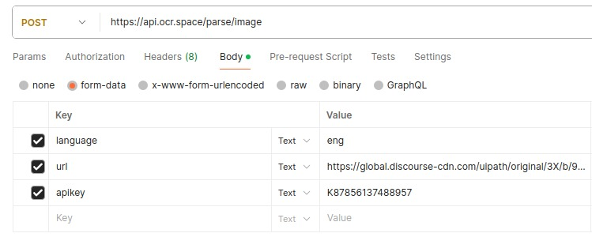

# Introduction
The primary purpose of the Handwriting Text Extractor is to streamline
and modernize the process of transcribing handwritten content. Whether
you have lecture notes, meeting minutes, or personal jottings, this
application enables users to convert their physical notes into editable
and searchable text with just a few clicks.

The Handwriting Text Extractor is an innovative application designed to
effortlessly convert handwritten text from images into digital, editable
content. Leveraging a powerful and user-friendly API developed by
experts.

## Index
- [Application Architecture](#application-architecture)
- [Text Extraction API](#text-extraction-api)
  - [OCR Functionality](#ocr-functionality)
  - [API Access](#api-access)
  - [Supported Image Formats](#supported-image-formats)  
  - [Multi-Language Support](#multi-language-support)
  - [Configuration and API Key](#configuration-and-api-key)
  - [Usage and Pricing](#usage-and-pricing)
  - [Documentation and Support](#documentation-and-support)
- [API endpoints](#api-endpoints)
- [Examples of API Requests and Responses](#examples-of-api-requests-and-responses)
- [Costs](#costs)

# Application Architecture


# Text Extraction API
- OCR.space uses the Tesseract OCR engine. Tesseract is an open-source OCR
engine developed by Google. It is known for its accuracy in recognizing
text in various languages and its ability to handle a wide range of
fonts and text layouts.

- The OCR.space service utilizes Tesseract as the underlying technology to
perform optical character recognition on images or scanned documents,
extracting text for further use. Tesseract has been widely adopted in
the OCR community and has a reputation for being robust and reliable.

#### OCR Functionality:
-   OCR.space specializes in converting images or scanned documents into machine-readable text. It can recognize printed or handwritten text within images and provide the extracted text as output.

#### API Access:
-   OCR.space provides an API (Application Programming Interface) that developers can use to programmatically interact with the OCR service. This allows integration into various platforms and programming languages.

#### Supported Image Formats:
-   OCR.space supports a variety of image formats, including common ones like JPEG, PNG, and GIF. It is designed to work with images that contain text, making it useful for applications where text extraction is required.

#### Multi-Language Support:
-   The OCR.space service typically supports recognition in multiple languages. This is important for users who need OCR capabilities for documents in languages other than English.

#### Configuration and API Key:
-   Users need to sign up for an OCR.space account and obtain an API key to access the OCR service. The API key is usually used for authentication when making requests to the OCR API.

#### Usage and Pricing:
-   OCR.space typically offers different usage plans, including free plans with limited usage and premium plans with higher usage limits and additional features. Users may need to choose a plan based on their specific needs and volume of OCR requests.

#### Documentation and Support:
-   OCR.space typically provides documentation and guides for developers to understand how to use the API effectively. This includes information on making API requests, handling responses, and integrating OCR functionality into applications. Additionally, there may be support options for users who encounter issues or have questions.

# API endpoints 
-   Documentarea tuturor endpoint-urilor API pentru extragerea textului.
-   Parametri de intrare și formatul așteptat pentru cererile API.

# Examples of API Requests and Responses

- Request



- Response

``` json
{
   "ParsedResults": [
       {
           "TextOverlay": {
               "Lines": [],
               "HasOverlay": false,
               "Message": "Text overlay is not provided as it is not requested"
           },
           "TextOrientation": "0",
           "FileParseExitCode": 1,
           "ParsedText": "gecqus e\r\nbe doin\r\n",
           "ErrorMessge": "a",
           "ErrorDetails": ""
       }
   ],
   "OCRExitCode": 1,
   "IsErroredOnProcessing": false,
   "ProcessingTimeInMilliseconds": "1500",
   "SearchablePDFURL": "Searchable PDF not generated as it was not requested."
}
```

# Costs
-   **Amazon EC2 Instances:**
   
    -   Our application will run on an EC2 instance of type t2.micro.
    -   The price for t2.micro instances is approximately \$0.0116/hour.
    -   If the application runs continuously for 24 hours a day for a month, the cost would be:
        -   \$0.0116/hour \* 24 hour/day \* 30 days = \$8.35
-   **Estimated Total Cost for One Month:**
    
    -   AWS Cost + API Cost = \$8.35 + \[API Specific Cost\]